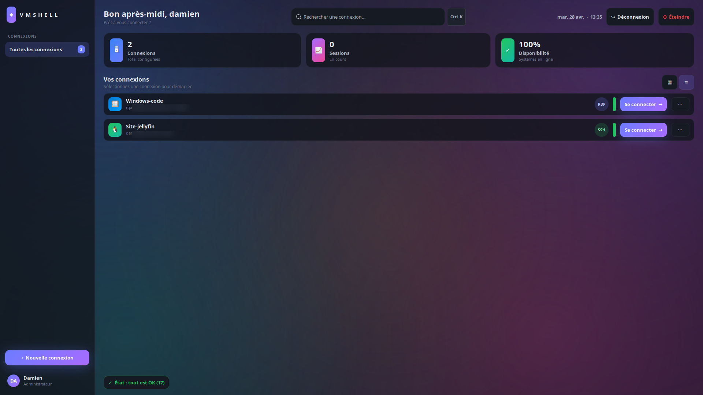

# VMShell

[](https://www.gnu.org/licenses/gpl-3.0)


**VMShell** est un gestionnaire de connexions distantes **RDP / SSH** pensé pour
fonctionner en **mode kiosque plein écran** sous Linux. Il intègre `xfreerdp3`
(ou `xfreerdp`) et un terminal VTE dans une interface GTK3 sombre, animée et
optimisée GPU/CPU selon le matériel détecté automatiquement.



> Cas d'usage : poste de travail unique dédié à la connexion sur des VM
> Windows / Linux distantes, sans bureau visible — l'utilisateur final ne voit
> que VMShell.

---

## ✨ Fonctionnalités

- **Multi-sessions** : ouvrez plusieurs VM simultanément, basculez entre elles
  via un menu Échap (clic ou raccourci).
- **RDP intégré** : `xfreerdp3` embarqué via XEmbed, son redirigé via PulseAudio,
  USB auto-redirigé (`/usb:auto`).
- **SSH intégré** : terminal VTE 2.91 directement dans la fenêtre.
- **Profils de performance** : `tranquille` (qualité, AVC444 si GPU) /
  `gamer` (RemoteFX + freeze des apps de fond pour priorité totale).
- **Détection GPU** automatique (NVIDIA / AMD / Intel) avec fallback CPU pur en
  RemoteFX léger.
- **Auto-diagnostic au démarrage** : 17 vérifications (binaires, modules
  Python, GPU, audio, réseau, USB, config persistante).
- **Auto-installation** des dépendances manquantes via `apt` / `dnf` / `pacman`.
- **Proposition de pilotes** GPU (NVIDIA / AMD / Intel) installables en un clic
  dans un terminal externe.
- **Mode kiosque LightDM** : `install.sh` configure une session X11 dédiée et
  optionnellement l'autologin.
- **Bouton « État système »** en bas à gauche : OK / Avertissements / Erreurs +
  journaux de sessions et de crashes consultables.
- **Robustesse** : auto-récupération JSON corrompus, capture des crashes, log
  des sessions, freeze/thaw garanti via `atexit`.

---

## 📋 Prérequis

- Linux (X11 recommandé — Wayland fonctionne mais l'embedding RDP est plus
  fiable en X11).
- Python 3.10+
- GTK 3, VTE 2.91, PyGObject, python-xlib
- FreeRDP 3 (`xfreerdp3`) ou FreeRDP 2 (`xfreerdp`)

Tout est géré automatiquement par `install.sh` sur Debian/Ubuntu, Fedora et
Arch.

---

## 🚀 Installation

### Mode kiosque (poste dédié)

```bash
git clone https://github.com/Univers4craft/vm-controle-interface-linux.git
cd vm-controle-interface-linux
sudo ./install.sh --autologin <utilisateur>
sudo reboot
```

Au redémarrage, LightDM ouvre directement VMShell en plein écran sous le
compte `<utilisateur>`.

Options de `install.sh` :

| Flag | Effet |
|---|---|
| `--autologin USER` | Autologin LightDM sur la session vmshell |
| `--no-autologin` | Désactive l'autologin |
| (rien) | Installe sans toucher à LightDM |

### Mode développement / test sur un poste classique

```bash
# Dépendances (Debian/Ubuntu)
sudo apt install -y python3 python3-gi python3-xlib \
    gir1.2-gtk-3.0 gir1.2-vte-2.91 gir1.2-gdkx11-3.0 \
    xdotool x11-xserver-utils freerdp3-x11

# Lancement
python3 vmshell.py
```

---

## 🎮 Raccourcis

| Touche | Action |
|---|---|
| `Échap` | Ouvre le menu de session (switch VM, fermer, ouvrir une autre VM) |
| `Ctrl + Shift + V` | Colle le presse-papier local dans la VM courante |
| `Ctrl + K` ou `Ctrl + F` | Focus la barre de recherche |
| `Ctrl + N` | Nouvelle connexion |
| Clic droit / molette sur une session | Ferme cette session |

### Presse-papier partagé

Le presse-papier est synchronisé automatiquement entre l'hôte Linux et toutes
les VM RDP ouvertes (option `+clipboard` de `xfreerdp`). Pour copier d'une VM
vers une autre :

1. Copiez (`Ctrl+C`) dans la VM A — le texte arrive sur le presse-papier local.
2. Bascule sur la VM B (Échap → clic sur la session).
3. Collez (`Ctrl+V`) dans la VM B.

Si la synchro automatique ne fonctionne pas (politiques GPO Windows, certains
serveurs RDP), un bouton **📋 Coller le presse-papier dans la VM** est
disponible dans le menu Échap (ou raccourci `Ctrl+Shift+V`) qui injecte
directement le texte via `xdotool`.

---

## 🩺 Auto-diagnostic

Le bouton **● État système** en bas à gauche ouvre un panneau avec :

- **Diagnostic** : 17 vérifications + correctifs proposés (pilotes GPU,
  paquets manquants) avec **installation en un clic** dans un terminal externe.
- **Sessions** : journal des connexions ouvertes/fermées.
- **Crashes** : trace des erreurs Python éventuelles.

---

## 🔒 Sécurité

- Les mots de passe RDP sont stockés en clair dans
  `~/.config/vmshell/connections.json` (mode 700). À utiliser uniquement sur un
  poste de confiance.
- Le code source ne contient **aucun secret** — `connections.json` n'est jamais
  committé (cf. `.gitignore`).

> ⚠ Pour un usage en environnement multi-utilisateur, envisagez d'intégrer un
> coffre-fort (libsecret, KWallet…). Les pull requests sont les bienvenues.

---

## 🛠 Architecture

```
vmshell.py            # Application GTK monolithique (~2900 lignes)
vmshell.css           # Thème sombre animé
vmshell.desktop       # Entrée Xsession (mode kiosque)
vmshell-session.sh    # Wrapper de session (Openbox + vmshell.py)
install.sh            # Installeur multi-distros (apt/dnf/pacman) + LightDM
```

Composants clés :

- `EscapeGrabber` (Xlib) : capture globale de la touche Échap, même quand
  `xfreerdp` détient le focus clavier.
- `Gtk.Stack` pour le multi-VM : aucun reparent → XEmbed reste valide.
- `tune_runtime()` : nice/ionice, env vars GPU, low-latency PulseAudio.
- `freeze_background_apps()` / `thaw_background_apps()` : SIGSTOP/SIGCONT des
  processus de fond en mode `gamer`, restauration garantie via `atexit`.

---

## 🤝 Contribuer

Les contributions sont bienvenues ! Pull requests, issues, traductions
(actuellement uniquement en français)…

Avant de committer :

```bash
python3 -c 'import ast; ast.parse(open("vmshell.py").read())'
bash -n install.sh
```

---

## 📜 Licence

Ce projet est distribué sous **GNU General Public License v3.0**.

Voir [LICENSE](LICENSE).

```
VMShell — Gestionnaire de connexions distantes
Copyright (C) 2026  Damien

This program is free software: you can redistribute it and/or modify it
under the terms of the GNU General Public License as published by the
Free Software Foundation, either version 3 of the License, or (at your
option) any later version.
```
